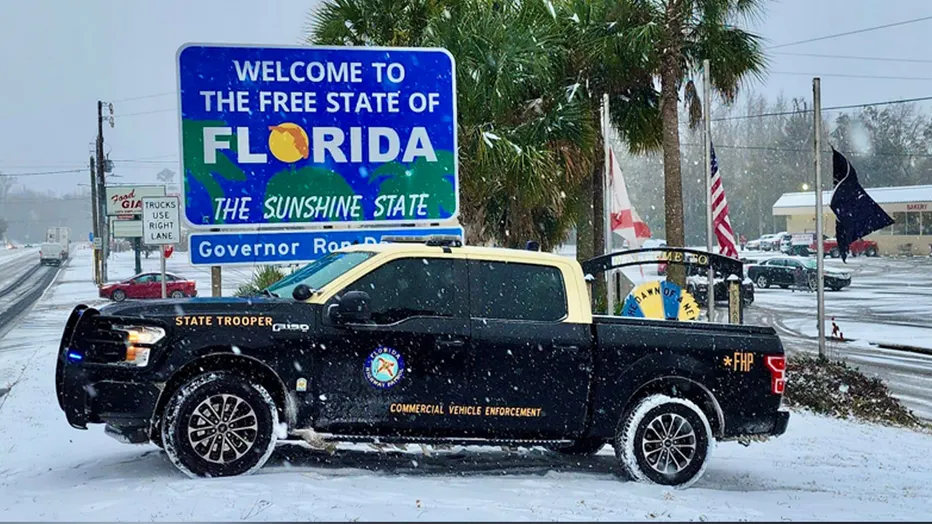

<i>Note: I work on this document all month until the end of the month. So it may get updated in real time.</i> 
## Ministry

### Youth Group
Started working in youth group for the first time after a reading a book called "Husband & Fathers" by Derek Prince (https://www.amazon.com/Husbands-Fathers-Rediscover-Creators-Purpose/dp/0800792742) and feeling conviction for the many teens who may not have that Christ centered foundation in thier home. So not sure what to expect or what that really looks like, but just thanking God for the oppertunity to serve and hopeful plant some seeds in these young men's lives. We shall see what comes of it.

### Brazil
In other news we are prepparing to team up with the body of Christ down in Brazil. We have some members of the church that moved down to Brazil full time to live and serve in a ministry capacity. Our family intends to try and help out where ever we can and just love on people. Not sure exaclty what that looks like either, but I have the family learning some basic Portuguese for getting by. I am hoping to be able to hold a converstation in Porteguese by March. So I will be studying in my spare time for the next 2 months to see how fluent I can become. I would at least like to be able to present the Gospel without an interpretuer.

### India (Uppahar)
Got two letters recently from some people that are serving the Lord over in India. I cannot go into too much detail for safety reasons and the hositility over there, but dsipite many things they are both doing well. One is a gentlman around my age (give or take) who preaches to High Caste system as he comes from the same. Another is a teenager who has been displaced by violence against Christians in India but he is doing well in school and overall. Praying for coninuted boldness and great harvest of for the Kingdom of God. I have not written back to them as of writing this which is another reason I am starting this blog. When friendships become international the post office is always nice, but a blog is a bit more consistant. 

## Gardening (Snow in Florida)
Well after looking at the cost of grocieries last year, I decided to become a farmer... sort of. I was however pulling weeds out in the garden beds about 2 hours after I did the math of food cost. Wouldn't you know it that many of the things that can normally handle Florida cold, died. Who knew it would snow in Florida. My beans I planted sure didn't.

## Techology Journey
In nerd news, for reasons I will not go into... I have had to quickly educate myself in Cyber Security defence and forensics with a bunch of White Hat Hacking stuff. Not the carear path I was looking into, but it is useful. 

My script kiddies (Library of Automation Scripts) have grown quite a bit as I have had to make more and more tools for both work and personal. Check it out if you wish. https://github.com/afrank84/DevOps-AutomationToolingV2