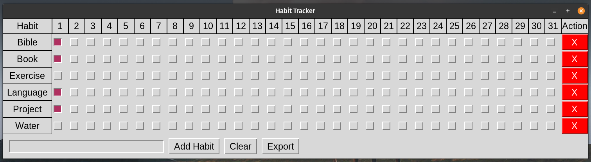

<i>Note: I work on this document all month until the end of the month. So it may get updated in real time.</i> 

## Technology Journey
### Working on a Habit Tracker
Recently needed to create my own anti-virus scanner and needed something that could run from a live booted usb running Ubuntu. I pretty much live 
and breath Powershell, but it always feels dirty and lack luster on Linux. Everything that is complicated in bash seems to die, so I figured I would 
give Perl a try since it was already on most Linux distros pre-installed. I was also familiar with TK from Python, so I figured I would try and make Pearl
GUI for my PopOS distro that could track habits. I built in Javascript first, but thought... hey maybe I can make an app, since many of the options 
I have suck. Mine still sucks too, but it meets my needs and took me less than an hour to code it. Maybe I will put code in repo if anyon is interested
and develop it more for my needs as my needs grow. Random note:

